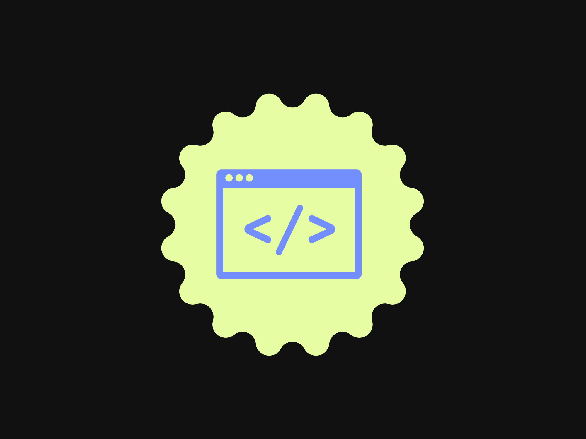

<link rel="stylesheet" href="https://cdnjs.cloudflare.com/ajax/libs/font-awesome/6.5.1/css/all.min.css" integrity="sha512-DTOQO9RWCH3ppGqcWaEA1BIZOC6xxalwEsw9c2QQeAIftl+Vegovlnee1c9QX4TctnWMn13TZye+giMm8e2LwA==" crossorigin="anonymous" referrerpolicy="no-referrer" />

  <a href="https://github.com/notomarmustafa">
    <h1 style="color: black;">Omar Mustafa 💻</h1></a>

I am a seasoned web developer and designer, fluent in HTML, CSS, JavaScript, Python, and PHP. With over couple years of hands-on experience, I specialize in crafting sleek and efficient digital solutions. My expertise ranges from front-end development using HTML, CSS, and JavaScript to back-end development with Python and PHP frameworks such as Django, Flask, Laravel, and CodeIgniter. I thrive on creating engaging and interactive web experiences while ensuring top-notch performance and user satisfaction. I'm dedicated to keeping up with the latest advancements in web development and enjoy sharing my knowledge with others through mentoring and active participation in tech communities. Let's build something amazing together!

 

<!-- Social icons section -->

  
  &#8287;&#8287;&#8287;&#8287;&#8287;
  
  &#8287;&#8287;&#8287;&#8287;&#8287;
  
  &#8287;&#8287;&#8287;&#8287;&#8287;
  
  &#8287;&#8287;&#8287;&#8287;&#8287;
  
  &#8287;&#8287;&#8287;&#8287;&#8287;
  
  &#8287;&#8287;&#8287;&#8287;&#8287;
  

---

### Languages and Tools 🧰

<!--  -->

<!--  -->

<!--  -->

 
 

#

### Stats 📊

 

 

 

 

 

#

 
<h1>Omar's Coding Journey 📰</h1>

<h2>My Journey in Web Development: A Multifaceted Exploration</h2>

<h4>My journey in web development has been a dynamic and enriching experience, marked by the exploration of various programming languages and technologies. From the foundational elements of HTML and CSS to the intricacies of JavaScript, Python, and PHP, each language has contributed to my growth as a developer in unique ways.</h4>

<h2>HTML and CSS: Building Blocks of the Web</h2>

<h4>My foray into web development began with HTML and CSS, the fundamental building blocks of the internet. HTML provided me with the structure and semantics necessary to create web pages, while CSS empowered me to style and design them to my liking. Through countless hours of trial and error, I honed my skills in crafting visually appealing and user-friendly interfaces, mastering the art of responsive design and layout optimization.</h4>

<h2>JavaScript: Unleashing Interactivity and Dynamism</h2>

<h4>As I delved deeper into the world of web development, I encountered JavaScript, a dynamic and versatile scripting language. JavaScript opened up a world of possibilities, enabling me to add interactivity and dynamism to my web applications. From creating dynamic forms and interactive animations to implementing client-side validation and asynchronous communication with servers, JavaScript empowered me to breathe life into static web pages and create engaging user experiences.</h4>

<h2>Python: Powering Backend Development and Beyond</h2>

<h4>With a solid foundation in frontend development established, I turned my attention to backend development with Python. Renowned for its simplicity, readability, and versatility, Python proved to be an invaluable asset in my coding arsenal. I leveraged Python's extensive libraries and frameworks to build robust web applications, handle database interactions, and implement complex algorithms and data processing tasks. Beyond web development, Python also introduced me to the exciting worlds of data science and machine learning, where I explored its capabilities in analyzing data, building predictive models, and extracting insights from vast datasets.</h4>

<h2>PHP: Navigating the Server-Side Landscape</h2>

<h4>In my quest for a deeper understanding of web development, I ventured into server-side scripting with PHP. PHP empowered me to create dynamic and interactive web applications, handling server-side logic and generating dynamic content seamlessly. With PHP, I gained proficiency in building feature-rich websites, implementing user authentication systems, and integrating with databases to store and retrieve data efficiently. The experience broadened my understanding of web development, equipping me with the skills to architect scalable and maintainable web solutions.</h4>

<h2>Conclusion: A Continuing Journey of Growth and Exploration</h2>

<h4>My journey in web development has been characterized by continuous learning, experimentation, and growth. From mastering the foundational elements of HTML and CSS to exploring the dynamic capabilities of JavaScript, Python, and PHP, each language has played a pivotal role in shaping my development journey. As I continue to evolve as a developer, I am excited to embrace new technologies, tackle complex challenges, and push the boundaries of what's possible in the dynamic and ever-evolving world of web development.</h4>
